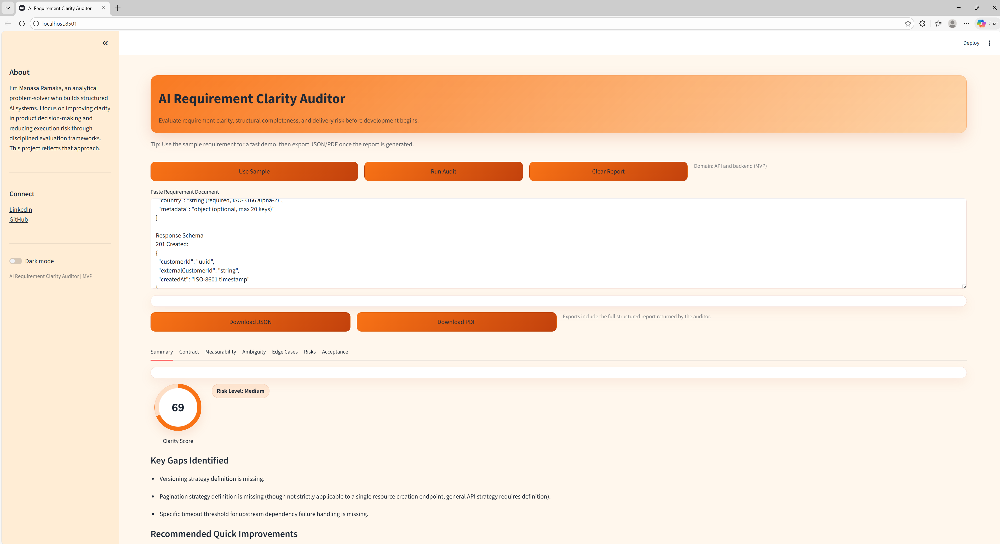

# AI Requirement Clarity Auditor

**An execution-readiness evaluation system that audits product requirements for structural clarity, measurability, and delivery risk before engineering begins.**

---

## Product Thesis

Ambiguity in requirements is one of the most preventable sources of execution risk in software delivery.

When specifications lack measurable definitions, explicit API contracts, or clearly defined edge cases, teams are forced to interpret intent. Interpretation creates misalignment across Product, Engineering, and QA, leading to rework, integration failures, and timeline slippage.

The AI Requirement Clarity Auditor acts as a pre-sprint quality gate.

Instead of generating new specifications, it audits existing requirements and surfaces structural gaps before development begins.

Clear requirements reduce delivery risk.

---

## Problem

In real-world product environments, requirements frequently contain:

- Vague or non-measurable language
- Missing contract definitions (endpoints, schemas, auth)
- Undefined failure modes
- Implicit assumptions about system behavior
- Incomplete performance expectations
- Limited visibility into operational or dependency risks

These gaps result in:

- Engineering building against interpretation instead of contract
- QA lacking testable acceptance criteria
- Integration risks surfacing late
- Cross-team friction
- Expensive iteration cycles

Ambiguity compounds at scale.

---

## Solution Overview

The AI Requirement Clarity Auditor evaluates a requirement document and produces a structured execution-readiness report including:

- Clarity Score (0–100)
- Risk Level (Low / Medium / High)
- Ambiguity flags with suggested measurable rewrites
- Contract completeness gaps
- Missing edge cases
- Risk and dependency indicators
- Generated Given–When–Then acceptance criteria
- Exportable JSON and PDF reports

The system transforms loosely written requirements into structured, auditable artifacts aligned with engineering execution.

---
## Interface Preview

## 🎥 Demo Video

Watch the 60-second demo here:

[▶ Watch Demo](https://youtu.be/qgWM8TCSXYc)

## Architecture

The system uses a hybrid evaluation model that combines deterministic validation with contextual AI reasoning.

flowchart TD
    A[Requirement Input] --> B[UI Layer]
    B --> C[Deterministic Checklist Engine]
    B --> D[LLM Analysis Engine]
    C --> E[Weighted Structural Score]
    D --> E
    E --> F[Structured Audit Report]
    F --> G[Export Layer]

## Deterministic Layer

- Contract completeness checks  
- Weighted scoring framework  
- Measurability detection  
- Explicit penalty for ambiguous language  

## AI Layer

- Contextual risk analysis  
- Ambiguity reasoning  
- Acceptance criteria generation  
- Executive summary synthesis  

The final clarity score blends structured validation with contextual reasoning to provide a defensible readiness assessment.

---

## Domain Focus: API & Backend Specifications

The MVP implements a domain module focused on API and backend systems, where ambiguity directly impacts integration reliability.

The system audits for:

- Endpoint paths and HTTP methods  
- Authentication and authorization strategy  
- Request and response schema definitions  
- Status codes and standardized error handling  
- Latency and throughput expectations  
- Rate limiting policies  
- Versioning strategy  
- Dependency identification  
- Idempotency and concurrency behavior  
- Explicit handling of failure modes  

The architecture supports modular expansion into domains such as Payments, Platform Infrastructure, or AI-driven features without modifying the core engine.

---

## Clarity Scoring Framework

The Clarity Score (0–100) is calculated using weighted structural categories:

- Contract Completeness – 30 points  
- Measurability – 20 points  
- Edge Case Coverage – 20 points  
- Specificity and Ambiguity Control – 15 points  
- Risk Awareness – 10 points  
- Testability and Acceptance Criteria – 5 points  

### Score Interpretation

**80–100**  
Implementation-ready with minimal structural risk.

**60–79**  
Moderate clarity with execution gaps.

**Below 60**  
High delivery risk requiring refinement before engineering begins.

The scoring framework is transparent and checklist-driven to ensure repeatability and defensibility.

---

## Why This Project Is Relevant to TPM Work

This project reflects key TPM competencies:

- Translating ambiguity into structured execution frameworks  
- Defining measurable readiness criteria  
- Identifying cross-system integration risk  
- Creating alignment between Product and Engineering  
- Designing scalable evaluation processes  
- Building tooling that reduces delivery friction  

It demonstrates the ability to think beyond feature implementation and focus on execution systems that improve delivery reliability.

---

## Technology Stack

### Frontend
- Streamlit  

### Backend
- Python  

### AI Integration
- Google Gemini API  
- Strict JSON response enforcement  
- Hybrid deterministic + AI scoring logic  

### Exports
- Structured JSON  
- PDF reporting  

### Deployment
- Free-tier compatible hosting  

---

## Future Extensions

- Domain modules for Payments and distributed systems  
- GitHub PR integration for requirement audits  
- CI/CD quality gate integration  
- Team-level clarity analytics dashboard  
- Configurable scoring weights by organization  

---

## Author

**Manasa Ramaka**  
Analytical problem-solver building structured AI systems that improve execution clarity and reduce delivery risk.

LinkedIn: https://www.linkedin.com/in/ramaka-manasa/  
GitHub: https://github.com/Manasaramaka/
